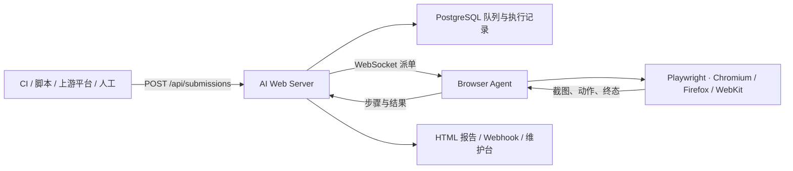
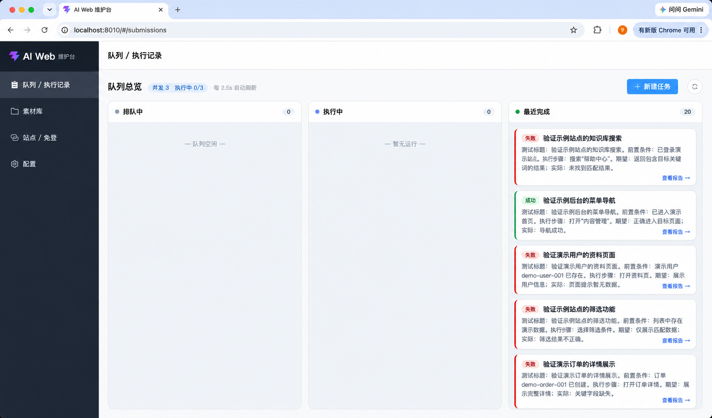
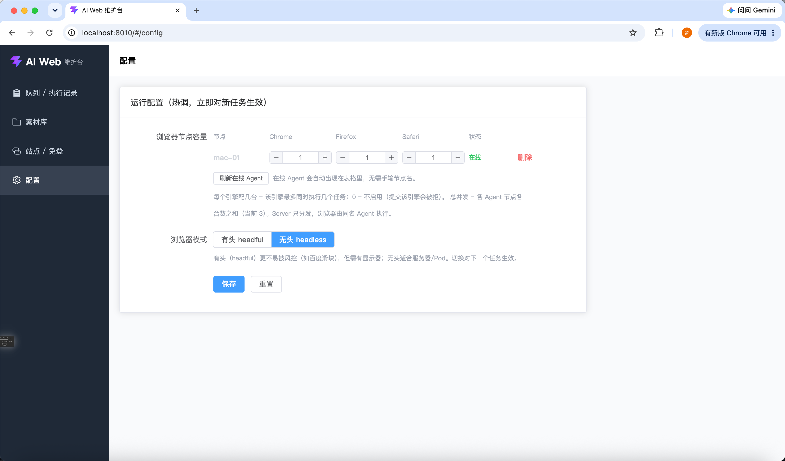
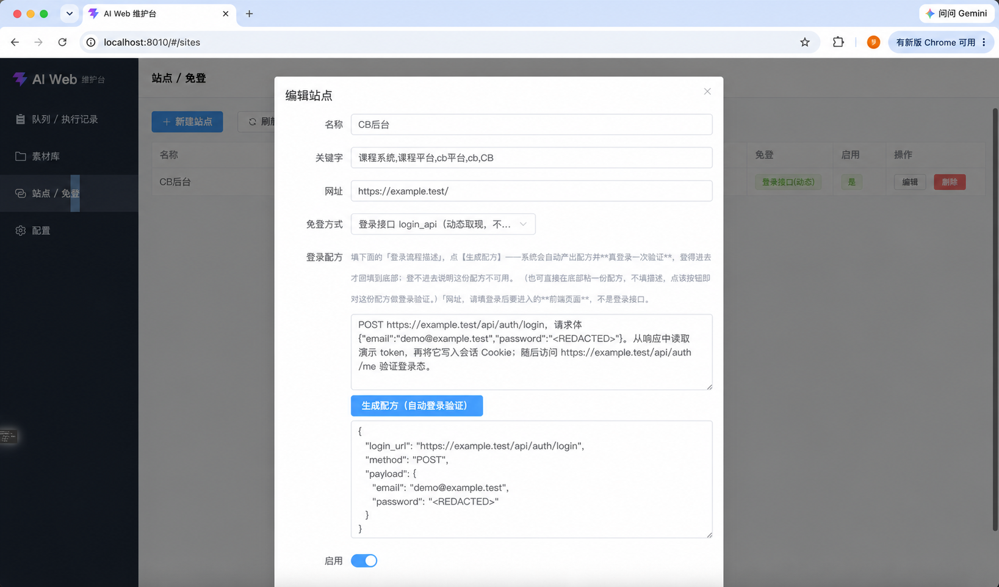

# AI Web

**AI Web 是一个由自然语言驱动的 Browser Agent 执行中台。**

调用方提交一句任务目标，AI Web Server 将任务分发给在线的 Browser Agent；Agent 在自己的机器上启动 Playwright 浏览器、调用视觉模型完成操作，并把每步截图、动作、报告和终态结果回传给 Server。

它适合被 CI、脚本或上游测试工作台调用，也可以直接作为一个轻量的 Web 自动化维护台使用。

> 当前 `main` 是唯一主线：**Server 负责队列、调度、记录和报告；Browser Agent 负责真正打开并操作浏览器。**

## 它能做什么

- **自然语言直跑**：不写 XPath、selector 或传统脚本，直接提交网页任务目标。
- **多浏览器并发**：按 Chrome（Chromium）/ Firefox / WebKit 分配 Agent 容量；同一任务可在多个浏览器引擎分别执行。
- **独立 Browser Agent**：浏览器运行在 Agent 机器，而不是 Server 容器；Windows、macOS、Linux 都可以作为执行节点。
- **可追溯报告**：保存每步截图、Thought、动作、耗时、Token 用量与最终结果，生成可直接打开的 HTML 报告。
- **API、Webhook 与 CLI**：可投递批次、查询进度、取消任务，并在任务或批次终态时回调调用方。
- **素材和站点上下文**：支持执行时上传素材、站点关键字映射、登录态注入，以及批次级/执行单元级 Function Map Context。
- **多模型适配**：主执行模型与辅助模型可独立选择豆包、Claude 或 OpenAI 协议。

## 它不是什么

AI Web 不维护项目、需求、用例库或人工测试流程。它只有：**提交、队列、执行、证据、报告和回调**。

如果你的任务是管理需求与测试资产，应由上游工作台完成；AI Web 的职责是把一条网页任务可靠地交给浏览器执行并回传证据。

## 作为 Case Flow 的 Web 子执行器

AI Web 可以作为 [Case Flow](https://github.com/dongxinsuperman/case-flow-ai) 的一个 **Web 子执行器** 被调用。Case Flow 负责组织用例、编排运行和查看整体结果；当其中一个用例需要真实操作网页时，由它通过 AI Web 的提交接口投递任务，AI Web 再调度 Browser Agent 执行并回传状态、报告和回调。

```text
Case Flow 用例 / 工作流
        ↓ 投递网页执行任务
AI Web（队列、调度、报告）
        ↓ 派单
Browser Agent（真实浏览器操作）
        ↓ 结果与证据回传
Case Flow 展示整体运行结果
```

这样分工后，Case Flow 不需要承载浏览器、模型调用和 Agent 节点管理；AI Web 也不需要维护用例库。对接格式见 [对外接口](<docs/对外接口文档（集成方）.md>)。

## 执行流程



例如，提交“打开 example.com 并验证标题包含 Example”后，Server 会选择一个有空闲 Chrome 容量的 Agent；Agent 打开浏览器执行；Server 最终返回报告 URL 和 success/failed 状态。

## 维护台一览

下面展示维护台的实际能力。其中，队列中的任务内容使用了可读的虚构示例；免登截图中的站点地址、请求地址、账号和密码均为演示值。

### 任务队列与执行记录

维护台将待执行、执行中和已完成任务分列展示；已完成任务可以进入对应的执行报告。



### 浏览器 Agent 槽位配置

可以为在线 Agent 分别设置 Chromium、Firefox 和 WebKit 的并发槽位，并选择有头或无头浏览器模式；新任务会按最新配置分发。



### 站点映射与免登配置

站点可按关键字匹配，并配置登录接口或其他登录态注入方式，使 Agent 在执行前获得可用会话。实际部署中，登录配方和凭据必须仅保存在受控环境。



## 快速开始

前置条件：Python 3.11+、PostgreSQL，以及一套可用的视觉模型配置。首次体验时，Server 和 Agent 可以运行在同一台机器，但它们仍是两个独立进程。

```bash
git clone https://github.com/dongxinsuperman/ai-web.git
cd aiweb/backend

python3.11 -m venv .venv
source .venv/bin/activate
pip install -e ".[agent]"
cp .env.example .env
```

编辑 `.env`，至少填写 PostgreSQL 连接和 `AIWEB_VLM_*`。默认 `AIWEB_BROWSER_SLOTS` 含 `mac-01`，因此本机 Agent 使用同名 ID：

```bash
# 终端 A：Server
python -m aiweb.main

# 终端 B：Browser Agent
source .venv/bin/activate
python -m playwright install chromium
python -m aiweb.agent --server http://127.0.0.1:8009 --agent-id mac-01

# 终端 C：维护台（可选）
cd ../web
npm install
npm run dev
```

投递一条最小任务：

```bash
curl -X POST http://127.0.0.1:8009/api/submissions \
  -H 'Content-Type: application/json' \
  -d '{
    "submissionName": "hello-web",
    "items": [{
      "caseId": "example-title",
      "runContent": "打开 https://example.com 并验证标题包含 Example",
      "platforms": ["chrome"]
    }]
  }'
```

完整步骤、环境变量和常见问题见 [快速开始](docs/快速开始.md)。

## 文档

| 想了解什么 | 文档 |
|---|---|
| 从零启动 Server、Agent 和前端 | [快速开始](docs/快速开始.md) |
| Server、Agent、队列和报告如何协作 | [Agent 主线架构](<docs/架构说明（Agent主线）.md>) |
| API、Webhook、浏览器平台和提交格式 | [对外接口](<docs/对外接口文档（集成方）.md>) |
| Agent 机器的 macOS / Windows / Linux 安装 | [Browser Agent 执行环境](docs/浏览器Agent执行环境安装.md) |
| 站点映射、Cookie、storageState 和登录接口 | [站点映射与免登](docs/站点映射与免登.md) |
| Function Map Context 的使用方式 | [Function Map Context](docs/Function-Map.md) |
| 模型协议与模型配置 | [多模型协议](<docs/多模型协议（豆包·Claude·GPT）.md>) |
| 部署边界、敏感数据与公网安全 | [开源边界与安全](docs/开源边界与安全.md) |
| 任务排队、Agent 断连、报告打不开等问题 | [故障排查](docs/故障排查.md) |
| 全部文档与历史资料 | [文档索引](docs/README.md) |

## 当前状态

当前主线已经具备：Browser Agent 调度、Chrome/Firefox/WebKit、任务投递与取消、步骤记录、HTML 报告、Webhook、素材库、站点免登、Function Map Context 和多模型适配。

AI Web 会逐步靠近 AI Phone 的“执行可靠性层”，但会按浏览器场景重新实现：**子步骤系统、中途审判、增强卡死检测和安全回放目前都还在计划中，尚未实现。** 当前只具备基础卡死提示、结构化任务识别和最终二次断言。详见 [执行可靠性路线图](docs/执行可靠性路线图.md)。

## 开源与安全

本项目以 [MIT License](LICENSE) 发布。参与方式见 [贡献指南](CONTRIBUTING.md)、[社区行为准则](CODE_OF_CONDUCT.md)；安全漏洞报告方式见 [安全策略](SECURITY.md)。

当前代码不会跟踪本地 `.env`、运行报告、截图、素材和数据库；部署时仍必须自行保护模型 Key、API Token、Cookie、登录态和执行数据。

**不要把默认匿名配置直接暴露到公网。** 面向外部网络部署时，应配置 `AIWEB_API_TOKEN`、TLS、反向代理和受控的 Agent 网络。
